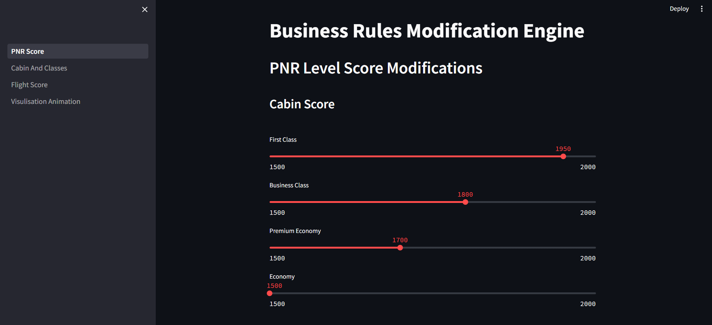
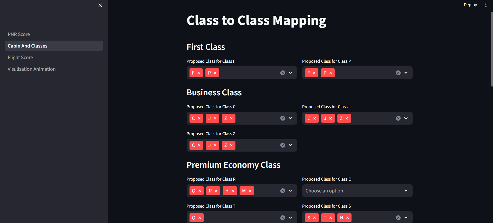
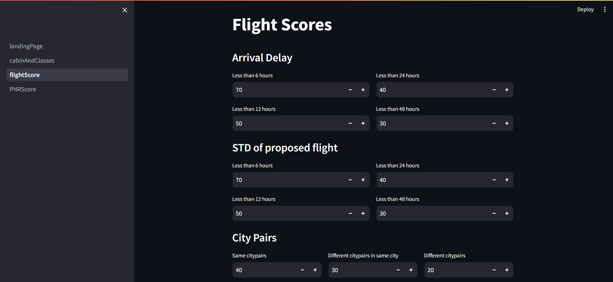
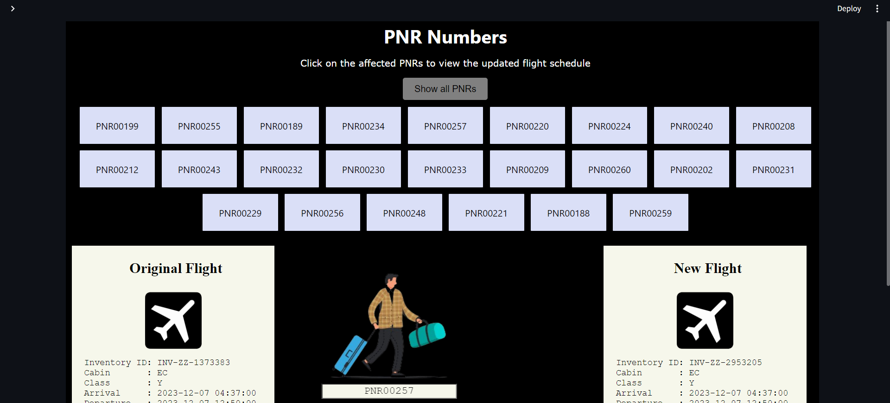

# Passenger-Recovery-Optimization

Airlines routinely change their flight schedules for various reasons like seasonal demands, picking new routes, time changes needed based on daylight savings, changes to flight numbers,
operating frequency, timings, etc. Many passengers get impacted due to these schedule
changes and they need to be regularly re-accommodated to alternate flights. 

The project uses a quantum computing-based approach to identify optimal alternate flight solutions for all impacted passengers based on certain constraints and considering various factors like PNR priority, time to reach the destination, and special passenger types without jeopardizing the flight experience for the passengers.


## Business Rules Engine using Streamlit

We have provided a GUI, deployed using `Streamlit` to easily modify the various scores for each attribute used to calculate PNR scores, flight grades, class allocation, etc.


## Deployment

### Installing the dependencies

Run the following command in the terminal
```
  pip install -r requirements.txt
```

### Setting up the environment file

Make a file named `.env` in the main folder, it's content should be:
```
GMAPS_API_KEY=your_actual_api_key
dwave_token=dwave_token
flight_mail = your_email_id
flight_mail_password = your_email_password (if using gmail, you need to generate an app password)
```

### Running the program
Now, to run the script enter the following command in the terminal
```bash
  streamlit run PNR_Score.py
```


## Working

Each file contains widgets to adjust various parameters along with some default values. On pressing the proceed button at the bottom of each page, all the values chosen are written into a python file as variables which can be imported for use in other programs.

 ### PNR_Score.py
- Used to modify scores for PNR priority calculation parameters like PAX, loyalty, classes, MCT, MAXCT, ETD, etc
- **writes to constants.py**
  


### Cabin_And_Classes.py
- Used to allow/disallow class changes during flight allocation and upgrade/downgrade rules
- **writes to classRules.py**
  


### Flight_Score.py
- Used to modify parameters used to rank the flight and allocate grades like arrival delay, STD and citypairs
- **writes to flightScores.py**
  


### Result_Visualisation.py
- Used to display the new and optimal flight and class details of re-accomadated passengers



## Glossary

A few terms commonly used by airlines and what they mean

- PNR\
Passenger name record data is unverified information provided by passengers and collected by air carriers to enable the reservation and check-in processes. The data is used by the air carriers to manage their air transportation services.

- Cabins\
Cabins divide every seat on a plane into different categories, each with its own price and set of rules. Fare cabins are identified by one-letter fare codes. There are four main cabins - First, Business, Premium Economy and Economy.

- Classes\
Each cabin is further divided various classes. They typically denote the level of service or fare type purchased by a passenger. The class often determines the amenities, seat comfort, services, and flexibility available during the flight.  

- PAX\
PAX denotes the number of passengers attached to a single PNR.

- SSR\
SSR stands for Special Service Request. SSRs are codes used within the airline industry to communicate specific passenger or flight-related requests and information to the airline's reservation and operation systems.

- Loyalty\
Frequent travelers or passengers who consistently choose to fly with a particular airline or its partners are incentivized by given a loyalty class like gold, and silver. Passengers with a high loyalty class are given a higher preference by the airline.

- MCT\
Minimum Connection Time between two connecting flights.

- MAXCT\
Maximum Connection Time between two connecting flights.

- ETD\
Estimated time of departure of a planned flight.


